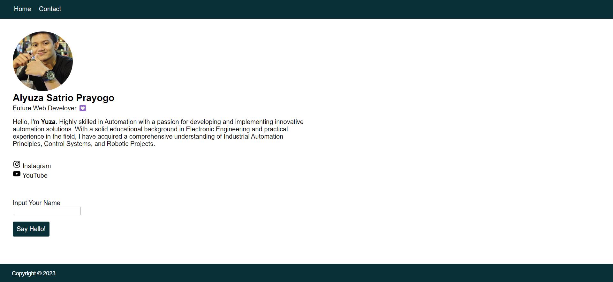

# Week-1 RevoU Mini Project
<!--  -->

## Hi, I'am Alyuza Satrio Prayogo 
This is my first repository, and I have built a simple website that contains :
- Profile
- Contact
- Media Social

## COMPONENTS I USE
- HTML
- CSS
- JavaScript
- Assets (Image)

Click [here](https://alyuza.netlify.app/) to see my Project.