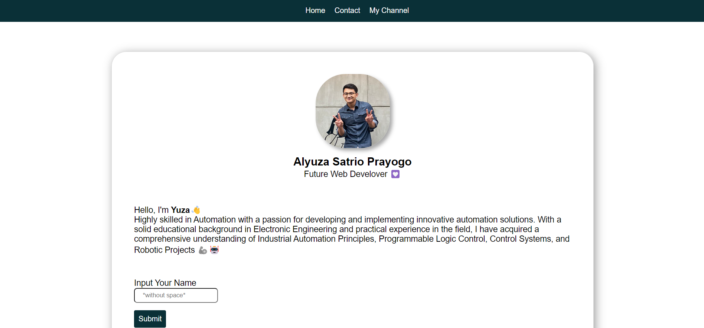

# Week-1 RevoU Individual Project 👨‍💻
<!--  -->

## Hi 👋 I'am Alyuza Satrio Prayogo 
This is my first repository and it's also my first project. I have built a simple website that contains :
- Profile
- Contact / Media Social
- My Channel

## COMPONENTS I USE
- HTML
- CSS
- JavaScript
- Assets (Image)

Click [here](https://alyuza.netlify.app/) to see my first Project 😉